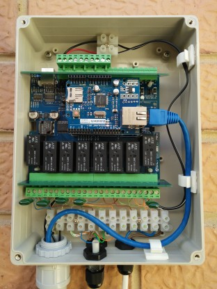

# RelayduinoMqttController

An [Arduino](http://arduino.cc) project to control an [Ocean Controls KTA-223 Relayduino](https://oceancontrols.com.au/KTA-223.html) via [MQTT](http://mqtt.org).



## Requirements

An Ocean Controls KTA-223 Relayduino with an ethernet shield installed.

In addition, an MQTT broker is required to running and accessible from the Arduino.

[Example code is included](extras), for [openHAB](http://openhab.org) and Python, to generate the required MQTT messages to control the relays and monitor inputs.

## Configuration

The MQTT broker address is required to be defined within the source code. Set the address on line 7 of file [mqttConfig.h](RelayduinoMqttController/mqttConfig.h).

## Compiling code

The project is structured for use both with [PlatformIO](http://platformio.org) and the [Arduino IDE](https://www.arduino.cc/en/Main/Software).

### PlatformIO

If using PlatformIO, the external libraries used in the project will be automatically added.

### Arduino IDE

When using the KTA-223 with the Arduino IDE select “Arduino Duemilenove w/ ATmega328”
from the “Tools->Board” menu.

In addition, the following libraries are required

- [PubSubClient](https://github.com/knolleary/pubsubclient)
- [MemoryFree](https://github.com/sudar/MemoryFree)
- [Time](http://www.pjrc.com/teensy/td_libs_Time.html)
- [TimeAlarms](http://www.pjrc.com/teensy/td_libs_TimeAlarms.html)
- [Relayduino](https://github.com/greenthegarden/Relayduino)

### Uploading Code

When uploading code to the Relayduino ensure the “AUTO” jumper is installed on the PCB.

## Operation

In order to make use of the program, MQTT structured messages must be generated.

To control each relay a messaged is required with the topic

```
relayduino/control/relay
```

and payload in the form `x,y`, where

- `x` is the relay number (1 to 8)
- `y` is either `0` for off or an integer to specify the duration, in mimutes, the relay should be on for.

For example to swich relay 2 on for 10 minutes, a message in the following form is used

```
relayduino/control/relay 2,10
```

Once the relay control message is received by the Arduino the relevant relay is switched on, and then a timer set to switch it off. The use of a timer, controlled by the Arduino, rather than external source, is used to ensure the relay is switched off even if the connection to the MQTT broker is lost.

On the change of state of a relay, a status message is published by the Arduino, with the topic

```
relayduino/status/relay
```

and payload, in the form `x,y`, where

- `x` is the relay number (1 to 8)
- `y` is either `0` or `1` to signifity whether the relay is off or on, respectively.

Data from the analog and digital KTA-223 inputs are oublished using the following MQTT topics

```
relayduino/input/analog
relayduino/input/opto
```

Other status messages are generated for reliability. See the file [mqttConfig.h](RelayduinoMqttController/mqttConfig.h) for details.

## Contact

Please let me know if you have any comments or suggesions.
