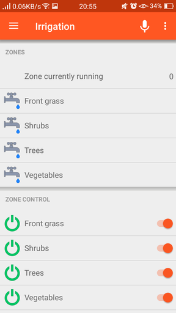
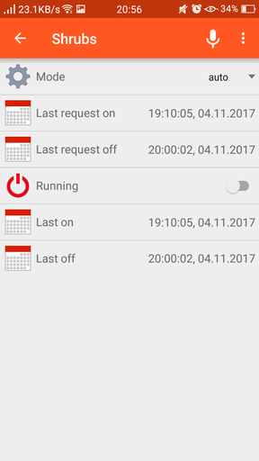
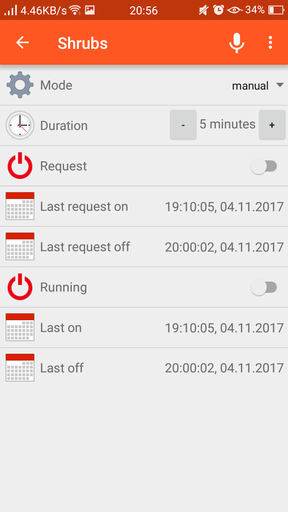
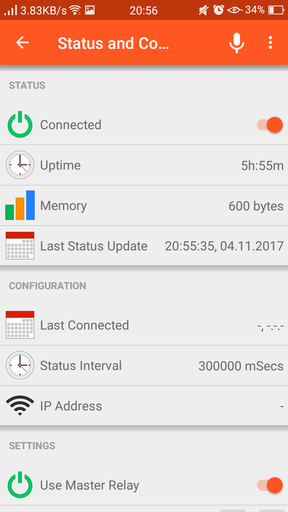

# RelayduinoMqttController Irrigiation Controller openHAB Configuration

Contains a configuration for [openHAB](http://www.openhab.org) which supports the following capabilities:

- allows manual control of relays with control over activation times.
- automatic (time-based) activation of relays based on calender events
- ensures only one relay is on at any time

## Screenshots

### Main Screen

The main sreen indicates which relay is currently on, and access to the details of each relay. At the bottom is access to the status and configutation tab.

### Relay Mode Automatic

With the relay in automatic mode only the current running status and Last on and last off times are visible.

### Relay Mode Manual

With the relay in manual mode, the duration can be set and a request for the relay to be switched on made.

 ### Status and Configuration

 Further details about the status of the Relayduino are available via the Status frames.

 

### Relay Configuration

Configuration for whether a master relay is used on the irrigiation system and default relay durations are available via the Settings frame of the Status and Configuration screen.

